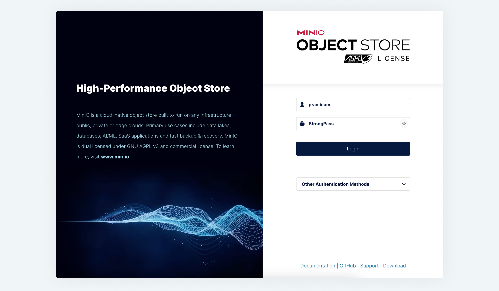
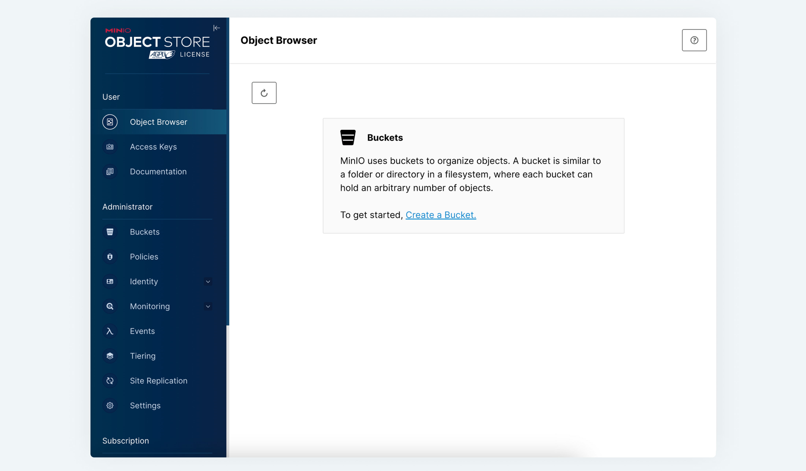
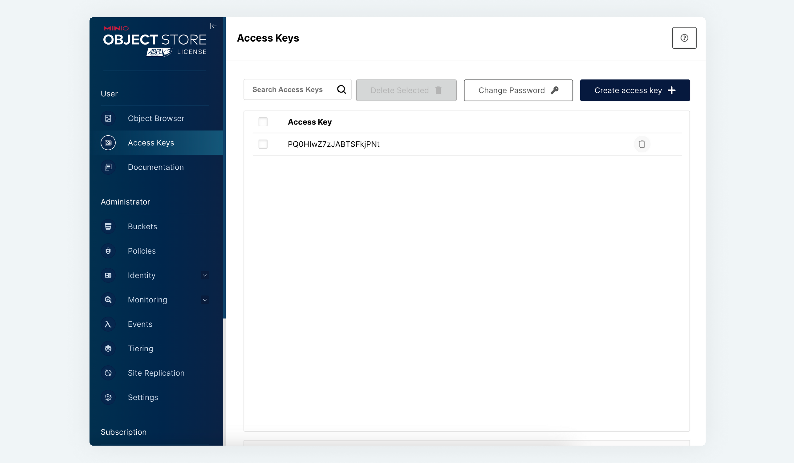

# Развернём своё хранилище!

S3 отлично подходит для хранения фильмов. Однако использование внешнего ресурса, коим является Amazon S3, сложно назвать оптимальным решением, ведь само хранилище не только территориально находится на удалении от серверов, обслуживающих ваше приложение, но и вне вашего контура безопасности. Значит, нужно организовать свое S3-хранилище данных! Например, с помощью MinIO.

### Что такое MinIO

[**MinIO**](https://min.io/){target="_blank"} — это объектное хранилище с открытым исходным кодом, совместимое с Amazon S3 API. Выпускается под лицензией Apache v2.

Особенности MinIO:

* MinIO очень быстрый: скорость чтения/записи — 183 ГБ/с и 171 ГБ/с на стандартном оборудовании.
* В MinIO масштабирование начинается с одного кластера, который может быть объединён с другими кластерами MinIO для создания глобального пространства имён, охватывающего при необходимости несколько центров обработки данных. Это одна из причин, по которой более половины компаний из списка Fortune 500 используют MinIO.
* MinIO можно установить и настроить за считанные минуты. Количество вариантов конфигурации минимально, поэтому задач системного администрирования становится мало, а сбоев почти не бывает.
* Cloud-native. Это программный подход к созданию, развёртыванию и управлению современными приложениями в средах облачных вычислений.
* Защита данных с использованием метода [Erasure code](https://en.wikipedia.org/wiki/Erasure_code#:~:text=In%20coding%20theory%2C%20an%20erasure,subset%20of%20the%20n%20symbols.){target="_blank"}.
* Поддерживается множественное шифрование.

Для использования хранилища в вашем приложении достаточно добавить несколько строк в `docker-compose.yaml` в раздел services:

```yaml
services:
  minio:
    image: minio/minio
    ports:
      - "9000:9000"
      - "9001:9001"
    environment:
      - MINIO_ROOT_USER=practicum
      - MINIO_ROOT_PASSWORD=StrongPass
    volumes:
      - minio_storage:/data
    command: server --console-address ":9001" /data
volumes:
  minio_storage:
```

После этого доступ к панели управления S3 хранилища будет доступен по адресу: [http://localhost:9001/](http://localhost:9001/){target="_blank"}.

Для входа в панель управления используйте значения, указанные в переменных окружения `MINIO_ROOT_USER` и `MINIO_ROOT_PASSWORD`.



Для начала работы необходимо создать бакет и пару `access key` и `secret_key` в соответствующих разделах меню.





Дальнейшая работа с MinIO практически ничем не отличается от работы с Amazon S3. 

В клиентском приложении можно использовать не только рассмотренный ранее [aioboto3](https://github.com/terrycain/aioboto3){target="_blank"}, но и [клиентское приложение от авторов MinIO](https://min.io/docs/minio/linux/developers/python/minio-py.html){target="_blank"}.

