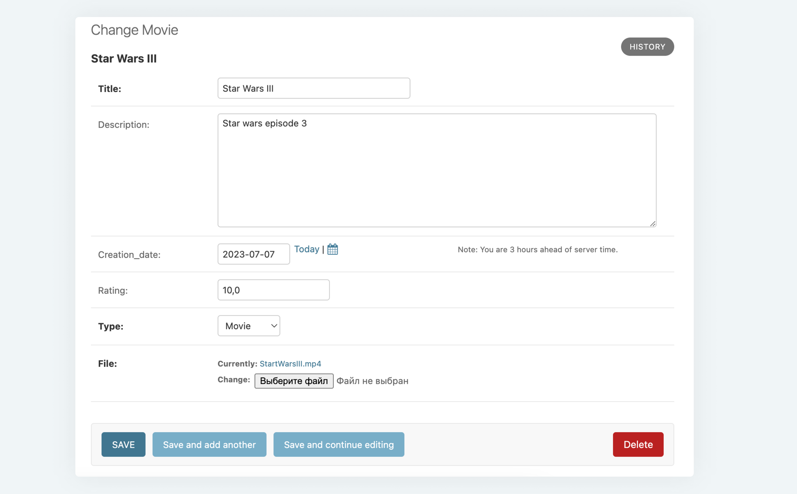
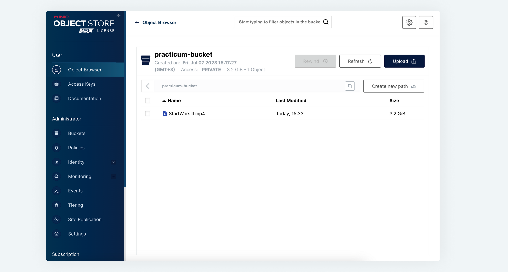

# Django FileAPI

Мы рассмотрели загрузку файлов в административной панели Django в локальное файловое хранилище и разобрались, почему этот способ хранения фильмов далёк от идеального.

Научим Django хранить файлы в S3-хранилище — в нашем сервисе MinIO. Для этого используем популярный пакет [django-storages](https://django-storages.readthedocs.io/en/latest/index.html){target="_blank"}.

Установим пакет:

```bash
pip install django-storages
```

Далее в файл `settings.py` добавим следующие строки, определяющие пару `access_key` и `secret_access_key`, имя бакета и адрес сервера S3:

```python
AWS_ACCESS_KEY_ID = 'PQ0HIwZ7zJABTSFkjPNt'
AWS_SECRET_ACCESS_KEY = 'rl1Teyyiu4JluY4uhak7ZzHCVNHbWV5BzClc2nq2'
AWS_STORAGE_BUCKET_NAME = 'practicum-bucket'
AWS_S3_ENDPOINT_URL = 'http://minio_service:9000'
```

После этого останется переопределить поле `file` в модели `FilmWork` и указать класс хранилища для файлов:

```python
file = FileField(storage=S3Boto3Storage(), null=True)
```

Теперь все загружаемые файлы будут отправляться в MinIO.





Всё работает! 

Однако у такого способа управления файлами есть один существенный недостаток: если потребуется поменять S3-хранилище на файловое или [блочное](https://aws.amazon.com/ru/what-is/block-storage/){target="_blank"}, то придётся менять код Django-админки и остальных сервисов, взаимодействующих с хранилищем.

Поэтому, чтобы избежать таких трудностей, мы и разработали сервис FileAPI! Все микросервисы кинотеатра, в части загрузки файлов и их получения, будут взаимодействовать с ним. 

Создадим класс `CustomStorage` — наследника `Storage` из пакета `django.core.files.storage`:

```python
from django.core.files.storage import Storage
from django.core.files.uploadedfile import InMemoryUploadedFile
import requests

class CustomStorage(Storage):
    def _save(self, name, content: InMemoryUploadedFile):
        r = requests.post(
            'http://file-api-service/api/v1/', files={'file': (content.name, content, content.content_type)}
        )
        # предполагается, что от сервиса приходит json-объект, содержащий поле 'short_name' с коротким именем файла
        return r.json().get('short_name')

    def url(self, name):
        return f'http://file-api-service/api/v1/download-stream/{name}'

    def exists(self, name):
        return False
```

Для работы этого хранилища необходимо переопределить три обязательных метода:
* `_save` — выполняется непосредственно при добавлении файла и возвращает имя файла для записи в базу данных. 
* `url` — адрес ссылки для скачивания файла (при клике в табличном представлении или в форме редактирования фильма).
* `exists` — проверяет уникальность имени файла в хранилище.

Остается только изменить поле `file` в модели `FilmWork`:

```python
file = FileField(storage=CustomStorage(), null=True)
```

Готово! Этих шагов достаточно, чтобы использовать сервис FileAPI в качестве хранилища файлов.
